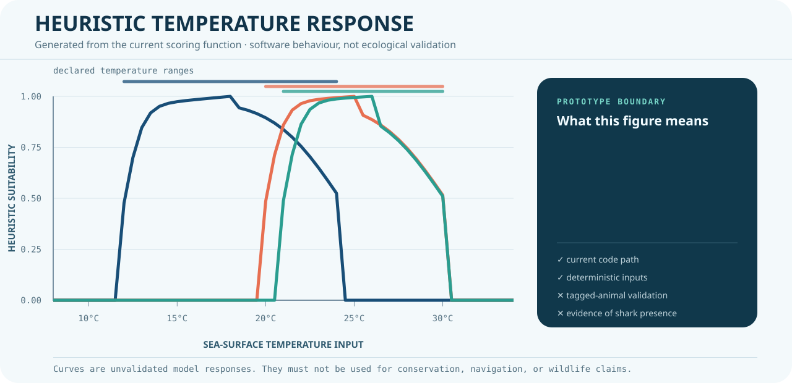

# Shark Habitat Prototype

A deterministic Python and Streamlit prototype for inspecting how
environmental variables flow into a shark-habitat suitability score.

This repository is a **learning prototype**, not a wildlife-tracking system, validated ecological model, or research product.

<p align="center">
  
</p>

The plot is generated from the current temperature-scoring function. It shows
how the software behaves for three example species; it is not an observation
dataset, an ecological benchmark, or evidence that sharks occupy a location.

## What it currently demonstrates

- A Streamlit interface for selecting species and study settings
- Species-specific preference tables and heuristic suitability scoring
- Map and chart generation with pandas, NumPy, Plotly, and related tools
- An early workflow shaped around sea-surface temperature, chlorophyll, and bathymetry inputs
- An opt-in NASA CMR catalog lookup kept separate from the generated grids

## Important limits

- The main application workflow uses generated environmental layers; it does not ingest satellite measurements.
- Generated paths use a fixed default seed (`2339`) so the same workflow is reproducible.
- Calling `auto_download_nasa_data(..., lookup_metadata=True)` adds a CMR catalog search, but does not change the generated grids into measurements.
- The repository does not provide live shark locations or confirm that sharks are present in a suggested area.
- The habitat scores have not been validated against tagged-animal observations, field surveys, or peer-reviewed ecological benchmarks.
- No claim of professional accuracy, research-grade quality, real-time satellite ingestion, or conservation suitability is made.

The former hard-coded telemetry example and pseudo-validation routine were
removed: generated locations and random error cannot measure ecological model
quality.

## Run locally

```bash
python -m venv .venv
# Windows: .venv\Scripts\activate
# macOS/Linux: source .venv/bin/activate

pip install -r requirements.txt
streamlit run app.py
```

The runtime dependency list contains only packages imported by the application or its optional data paths. TensorFlow, scikit-learn, and Matplotlib are not required.

Experimental authenticated NASA Earthdata requests require your own runtime token. See [NASA_TOKEN_SETUP.md](NASA_TOKEN_SETUP.md); the code reads only `EARTHDATA_TOKEN` and does not need a credential committed to the repository. The Streamlit workflow does not require a token, and a token does not turn the prototype into a live-data or validated system.

## Verify the checkout

The repository includes dependency-free checks for Python syntax and current-tree secret hygiene:

```bash
python -m compileall -q app.py automatic_nasa_framework.py tests
python -m unittest discover -s tests -v
```

GitHub Actions runs the same checks for every push and pull request.
It also installs the declared runtime dependencies, starts Streamlit, and checks the health endpoint.

After installing the runtime dependencies, rebuild or verify the README figure:

```bash
python tools/render_readme_assets.py
python tools/render_readme_assets.py --check
```

## License

The code is available under the [MIT License](LICENSE). Documentation and external datasets may have their own terms.

## Security note

NASA Earthdata credentials must be supplied at runtime through a local environment variable or another untracked secret store. Never place an access token in source code, examples, screenshots, issues, or commits.

Before any future public release that enables live ingestion:

1. rotate any credential that was previously committed through the provider;
2. decide separately whether to rewrite Git history;
3. add tests that distinguish real ingestion from simulated fallback data; and
4. record dataset names, timestamps, units, transformations, and failure modes.

## Sensible next steps

- Replace generated layers with a documented public dataset adapter
- Add deterministic fixtures and unit tests for every scoring component
- Compare scores against a named observation dataset
- Attach provenance and uncertainty to every map layer
- Review species parameters with a qualified marine scientist

Until those steps are complete, use this repository only as a software and visualization prototype.
